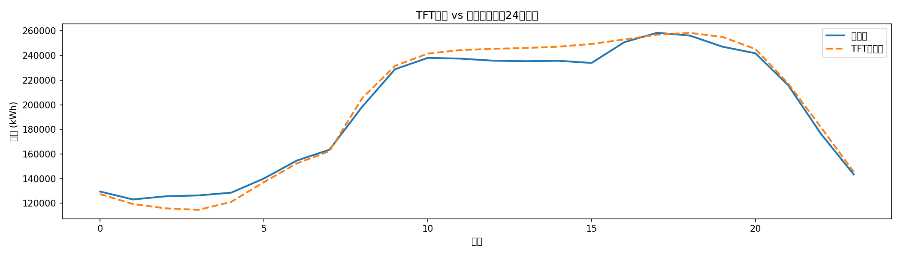
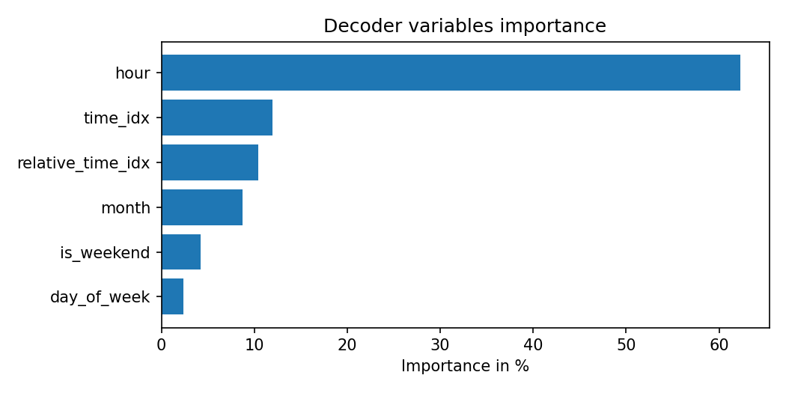

# EnergyCast — 电力负荷预测 + LLM 分析系统

基于UCI公开电力数据集，构建端到端时序预测pipeline，训练Temporal Fusion Transformer（TFT）模型预测未来24小时用电量，并接入LLM实现自然语言交互分析。

## 技术栈

- **时序预测**：Temporal Fusion Transformer（pytorch-forecasting）
- **LLM接入**：Groq API（llama-3.3-70b-versatile）
- **数据处理**：Pandas、Parquet
- **训练框架**：PyTorch Lightning

## Pipeline

1. **数据处理**：下载UCI电力数据集（2011-2014，370个客户），聚合为总负荷，提取时间特征和滞后特征，切分为训练/验证/测试集
2. **模型训练**：TFT模型，输入过去168小时（7天），预测未来24小时，使用QuantileLoss输出预测区间
3. **LLM接入**：将TFT预测结果传入LLM，支持自然语言查询和分析

## 结果

模型在测试集上准确捕捉日用电趋势，白天高负荷时段误差约5-10%。

特征重要性分析显示：
- Encoder端：历史load（32%）和hour（20%）是最重要的输入特征
- Decoder端：hour（62%）主导未来预测，验证了电力用量的强时间规律

## 数据来源

[UCI Electricity Load Diagrams 2011-2014](https://archive.ics.uci.edu/dataset/321/electricityloaddiagrams20112014)
